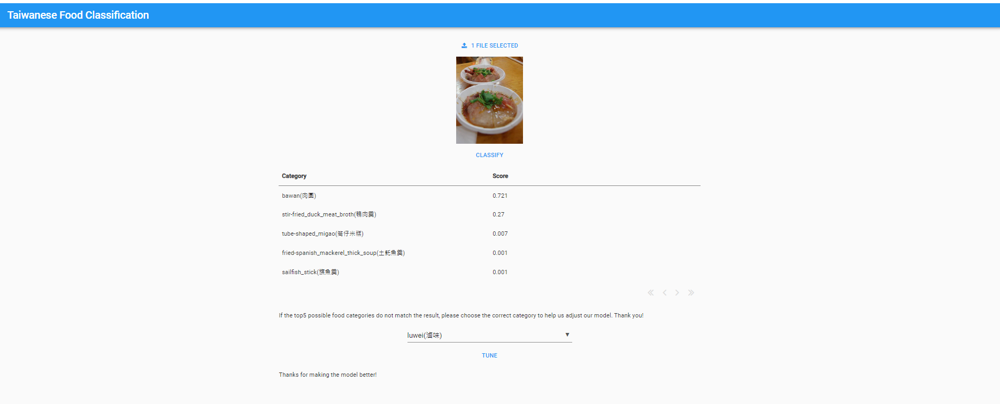

# Taiwanese-Local Food-classification-APP

Using deep learning technique to build a model and the product of ANVIL to build the interactive user interface. ([Taiwanese food claaification APP](https://foodclassification.anvil.app). Email me if you want to try our app: [Email](h1648886@gmail.com).)

### Description of our APP

* Users can upload their own image then click the 'classify' buttom, we'll show the Top-5 score of the categories of the image.

* If the result of our APP doesn't match the true category, we also provide a list of the categories that the users can just choose the correct category and then click 'tune' buttom to help us fine-tune our model.
*  [Demo video](https://youtu.be/DlKp4pPSPNw?t=458&si=whn8aNPYC_Nt0iaa)

### Training data collection

* We collected training data from Kaggle and Google search engine. The categories of the food like bawan, tanhulu, beef noodles,... are all popular Taiwanese foods.

* The data from Google search engine collected by Web-crawler.py.

### Model description

* The models we constructed behind the APP based on the popular deep learning model- EfficientNetV2S.

* Transfer learning technique: We firstly import a pre-trained EffcientNetV2S by imagenet from Tensorflow as based model then add dense layers behind EfficientNetV2S.

* Model1.py: Freeze the parameters of the based model and the final layer of the model includes 101 neurons used for making prediction. Train the model by Kaggle dataset.

* Model2.py: Same architecture as Model1.py and set the parameters the same as that of Model1.py then train the model by the web-crawler dataset.

* Domainselector.py: Add dense layers behind based model and the final layer of the model includes only one neuron for recognizing the  of the data. Train the model by all the data and

